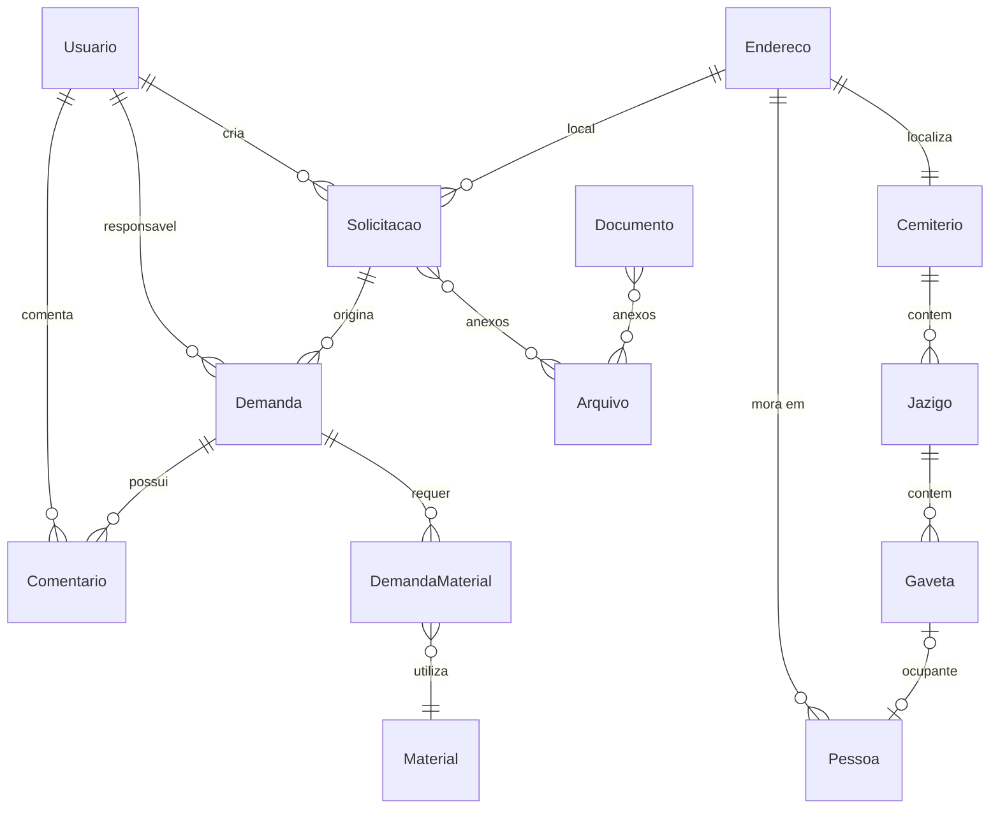

# SIGESI - Sistema de Gerenciamento da Secretaria de Infraestrutura

Sistema web para gerenciamento de demandas da Secretaria de Infraestrutura, incluindo controle de solicitacoes de cidadaos, gestao de demandas de trabalho, materiais, documentos oficiais e administracao de cemiterios municipais.

## Tecnologias

| Camada | Tecnologia |
|--------|-----------|
| Linguagem | Java 21 |
| Framework | Spring Boot 3.5 |
| Banco de dados | PostgreSQL 17 |
| ORM | Hibernate / Spring Data JPA |
| Autenticacao | OAuth2 com Google (Spring Security) |
| Object Storage | MinIO |
| Mensageria | RabbitMQ |
| Mapeamento DTO | MapStruct 1.5.5 |
| Documentacao API | SpringDoc OpenAPI (Swagger UI) |
| Qualidade de codigo | Checkstyle |
| Build | Maven |
| Containerizacao | Docker / Docker Compose |
| CI/CD | GitHub Actions |

## Pre-requisitos

- Java 21+
- Maven 3.9+
- PostgreSQL 17
- MinIO (ou S3-compatible storage)
- Credenciais OAuth2 do Google ([Google Cloud Console](https://console.cloud.google.com/))

Ou simplesmente:

- Docker e Docker Compose

## Inicio rapido com Docker

```bash
# Clone o repositorio
git clone <url-do-repositorio>
cd sigesi

# Configure as variaveis de ambiente
cp .env.example .env
# Edite o .env com suas credenciais

# Suba os servicos
docker compose up -d
```

A aplicacao estara disponivel em `http://localhost:8080`.

## Desenvolvimento local

```bash
# Instale as dependencias e compile
mvn clean install

# Execute a aplicacao
mvn spring-boot:run
```

### Variaveis de ambiente

Copie `.env.example` para `.env` e configure:

| Variavel | Descricao |
|----------|-----------|
| `GOOGLE_CLIENT_ID` | Client ID do Google OAuth2 |
| `GOOGLE_CLIENT_SECRET` | Client Secret do Google OAuth2 |
| `DATABASE_URL` | URL JDBC do PostgreSQL |
| `DATABASE_USER` | Usuario do banco de dados |
| `DATABASE_PASSWORD` | Senha do banco de dados |
| `MINIO_ACCESS_KEY` | Chave de acesso do MinIO |
| `MINIO_SECRET_KEY` | Chave secreta do MinIO |
| `ADMIN_EMAIL` | Email do usuario administrador |
| `RABBITMQ_HOST` | Host do RabbitMQ |
| `RABBITMQ_PORT` | Porta do RabbitMQ |
| `RABBITMQ_USERNAME` | Usuario do RabbitMQ |
| `RABBITMQ_PASSWORD` | Senha do RabbitMQ |

### Comandos uteis

```bash
# Executar testes
mvn test

# Executar um teste especifico
mvn test -Dtest=NomeDaClasse

# Verificar estilo de codigo
mvn checkstyle:check

# Build sem testes
mvn clean package -DskipTests
```

## Arquitetura

O projeto segue uma organizacao **package-by-feature**, onde cada modulo contem suas proprias camadas (Entity, Controller, Service, Repository, DTOs).

```
src/main/java/com/sigesi/sigesi/
├── arquivos/          # Upload e gestao de arquivos
├── auditoria/         # Auditoria de entidades (Hibernate Envers)
├── authentication/    # Configuracao de autenticacao
├── cemiterios/        # Gestao de cemiterios
├── comentarios/       # Comentarios em demandas
├── config/            # Configuracoes do Spring (Security, OAuth2)
├── demandas/          # Demandas de trabalho e materiais
├── documentos/        # Documentos oficiais (oficios, memorandos)
├── enderecos/         # Gestao de enderecos
├── gavetas/           # Espacos de sepultura
├── jazigos/           # Jazigos em cemiterios
├── materiais/         # Catalogo de materiais
├── notifications/     # Servico de notificacoes (RabbitMQ)
├── pessoas/           # Cadastro de pessoas
├── solicitacoes/      # Solicitacoes de cidadaos
├── storage/           # Integracao com MinIO
└── usuarios/          # Gestao de usuarios e roles
```

## Modelo de dados

O diagrama completo do banco de dados esta disponivel em [`DER.md`](DER.md).



### Entidades principais

| Entidade | Descricao |
|----------|-----------|
| **Usuario** | Usuarios do sistema autenticados via Google OAuth2, com roles (CIDADAO, OPERADOR, AGENTE, ADMIN) |
| **Solicitacao** | Solicitacoes de cidadaos sobre problemas de infraestrutura (buracos, esgoto, iluminacao, limpeza) |
| **Demanda** | Demandas de trabalho geradas a partir de solicitacoes, com responsavel, prazo e status |
| **DemandaMaterial** | Relacao entre demandas e materiais necessarios, com quantidade |
| **Material** | Catalogo de materiais disponiveis com preco |
| **Comentario** | Comentarios de acompanhamento em demandas |
| **Documento** | Documentos oficiais (oficios e memorandos) com geracao de PDF |
| **Arquivo** | Arquivos enviados armazenados no MinIO |
| **Cemiterio** | Cemiterios municipais com endereco |
| **Jazigo** | Jazigos dentro de cemiterios, identificados por quadra/rua/lote |
| **Gaveta** | Espacos individuais dentro de jazigos, podendo ter um ocupante |
| **Pessoa** | Cadastro de pessoas (ocupantes de gavetas, etc.) |
| **Endereco** | Enderecos compartilhados entre cemiterios, pessoas e solicitacoes |

## API

A documentacao interativa da API esta disponivel via Swagger UI em:

```
http://localhost:8080/swagger-ui.html
```

### Endpoints

| Modulo | Base | Operacoes |
|--------|------|-----------|
| Usuarios | `/api/usuarios` | GET, PATCH (toggle ativo, role) |
| Solicitacoes | `/api/solicitacoes` | CRUD completo |
| Demandas | `/api/demandas` | CRUD completo |
| Comentarios | `/api/comentarios` | CRUD completo |
| Documentos | `/api/documentos` | CRUD + geracao PDF |
| Materiais | `/api/materiais` | CRUD completo |
| Arquivos | `/api/arquivos` | Upload, download, delete |
| Cemiterios | `/api/cemiterios` | CRUD completo |
| Jazigos | `/api/jazigos` | CRUD completo |
| Gavetas | `/api/gavetas` | CRUD completo |
| Pessoas | `/api/pessoas` | CRUD completo |
| Enderecos | `/api/enderecos` | CRUD completo |

Todos os endpoints requerem autenticacao OAuth2.

## Deploy

### Producao com Docker Compose

O arquivo `compose-prod.yaml` configura o ambiente completo de producao:

```
┌─────────┐     ┌──────────┐     ┌────────────┐
│  Nginx  │────>│ Frontend │     │  RabbitMQ  │
│  :80    │────>│          │     │ :5672/:15672│
└─────────┘     └──────────┘     └─────┬──────┘
      │                                │
      v                                v
┌──────────┐     ┌────────┐     ┌─────────────────┐
│ Backend  │────>│  MinIO │     │  Notification   │
│  :8080   │     │ :9000  │     │    Service      │
└────┬─────┘     └────────┘     └───────┬─────────┘
     │                                  │
     v                                  v
┌──────────┐                    ┌──────────────┐
│ Postgres │                    │ Postgres     │
│   :5432  │                    │ (notif) :5433│
└──────────┘                    └──────────────┘
```

### CI/CD

O pipeline GitHub Actions executa automaticamente:

- **CI** (push/PR para `main`/`develop`): build, checkstyle, testes
- **CD** (push para `main`/`develop`): build da imagem Docker, push para Docker Hub, deploy na VPS

## Qualidade de codigo

O projeto utiliza Checkstyle com regras estritas:

- Arquivos: max 1500 linhas
- Linhas: max 140 caracteres
- Metodos: max 50 linhas, max 5 parametros, max 3 returns
- Aninhamento: max 3 ifs, max 2 fors, max 3 trys
- Javadoc obrigatorio em declaracoes de tipo
- Proibido `System.out.println`
- Sem imports nao utilizados ou redundantes

## Testes

O projeto possui 41 arquivos de teste cobrindo Controller, Entity e Service de cada modulo.

```bash
# Executar todos os testes
mvn test

# Executar testes de um modulo
mvn test -Dtest="com.sigesi.sigesi.demandas.*"
```
