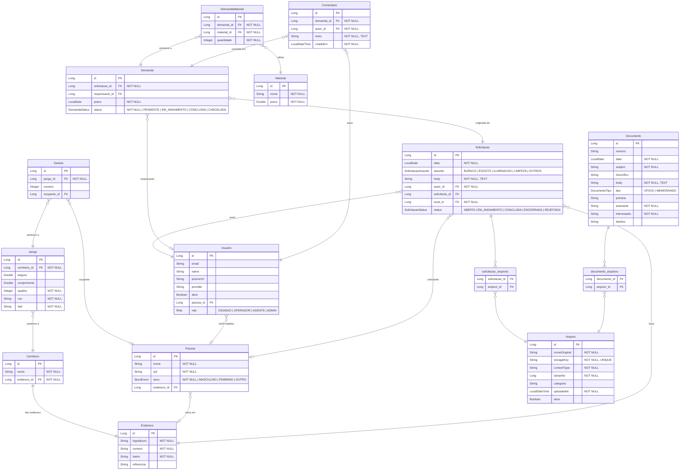

# Diagrama do Banco de Dados - SIGESI

```mermaid
erDiagram
    Usuario {
        Long id PK
        String email
        String name
        String pictureUrl
        String provider
        Boolean ativo
        Long pessoa_id FK
        Role role "CIDADAO | OPERADOR | AGENTE | ADMIN"
    }

    Endereco {
        Long id PK
        String logradouro "NOT NULL"
        String numero "NOT NULL"
        String bairro "NOT NULL"
        String referencia
    }

    Cemiterio {
        Long id PK
        String nome "NOT NULL"
        Long endereco_id FK "NOT NULL"
    }

    Jazigo {
        Long id PK
        Long cemiterio_id FK "NOT NULL"
        Double largura
        Double comprimento
        Integer quadra "NOT NULL"
        String rua "NOT NULL"
        String lote "NOT NULL"
    }

    Gaveta {
        Long id PK
        Long jazigo_id FK "NOT NULL"
        Integer numero
        Long ocupante_id FK
    }

    Pessoa {
        Long id PK
        String nome "NOT NULL"
        String cpf "NOT NULL"
        SexoEnum sexo "NOT NULL | MASCULINO | FEMININO | OUTRO"
        Long endereco_id FK
    }

    Solicitacao {
        Long id PK
        LocalDate data "NOT NULL"
        SolicitacaoAssunto assunto "BURACO | ESGOTO | ILUMINACAO | LIMPEZA | OUTROS"
        String body "NOT NULL, TEXT"
        Long autor_id FK "NOT NULL"
        Long solicitante_id FK
        Long local_id FK "NOT NULL"
        SolicitacaoStatus status "ABERTA | EM_ANDAMENTO | CONCLUIDA | ENCERRADA | REJEITADA"
    }

    Arquivo {
        Long id PK
        String nomeOriginal "NOT NULL"
        String storageKey "NOT NULL, UNIQUE"
        String contentType "NOT NULL"
        Long tamanho "NOT NULL"
        String categoria
        LocalDateTime uploadedAt "NOT NULL"
        Boolean ativo
    }

    Demanda {
        Long id PK
        Long solicitacao_id FK "NOT NULL"
        Long responsavel_id FK
        LocalDate prazo "NOT NULL"
        DemandaStatus status "NOT NULL | PENDENTE | EM_ANDAMENTO | CONCLUIDA | CANCELADA"
    }

    DemandaMaterial {
        Long id PK
        Long demanda_id FK "NOT NULL"
        Long material_id FK "NOT NULL"
        Integer quantidade "NOT NULL"
    }

    Material {
        Long id PK
        String nome "NOT NULL"
        Double preco "NOT NULL"
    }

    Comentario {
        Long id PK
        Long demanda_id FK "NOT NULL"
        Long autor_id FK "NOT NULL"
        String texto "NOT NULL, TEXT"
        LocalDateTime criadoEm "NOT NULL"
    }

    Documento {
        Long id PK
        String numero
        LocalDate data "NOT NULL"
        String subject "NOT NULL"
        String honorifico
        String body "NOT NULL, TEXT"
        DocumentoTipo tipo "OFICIO | MEMORANDO"
        String portaria
        String assinante "NOT NULL"
        String interessado "NOT NULL"
        String destino
    }

    solicitacao_arquivos {
        Long solicitacao_id FK
        Long arquivo_id FK
    }

    documento_arquivos {
        Long documento_id FK
        Long arquivo_id FK
    }

    %% Relacionamentos - Modulo Cemiterio
    Cemiterio ||--|| Endereco : "tem endereco"
    Jazigo }o--|| Cemiterio : "pertence a"
    Gaveta }o--|| Jazigo : "pertence a"
    Gaveta }o--o| Pessoa : "ocupante"
    Pessoa }o--o| Endereco : "mora em"
    Usuario }o--o| Pessoa : "perfil cidadao"

    %% Relacionamentos - Modulo Solicitacoes
    Solicitacao }o--|| Usuario : "autor"
    Solicitacao }o--o| Pessoa : "solicitante"
    Solicitacao }o--|| Endereco : "local"
    Solicitacao ||--o{ solicitacao_arquivos : ""
    solicitacao_arquivos }o--|| Arquivo : ""

    %% Relacionamentos - Modulo Demandas
    Demanda }o--|| Solicitacao : "originada de"
    Demanda }o--o| Usuario : "responsavel"
    DemandaMaterial }o--|| Demanda : "pertence a"
    DemandaMaterial }o--|| Material : "utiliza"

    %% Relacionamentos - Modulo Comentarios
    Comentario }o--|| Demanda : "comenta em"
    Comentario }o--|| Usuario : "autor"

    %% Relacionamentos - Modulo Documentos
    Documento ||--o{ documento_arquivos : ""
    documento_arquivos }o--|| Arquivo : ""
```
