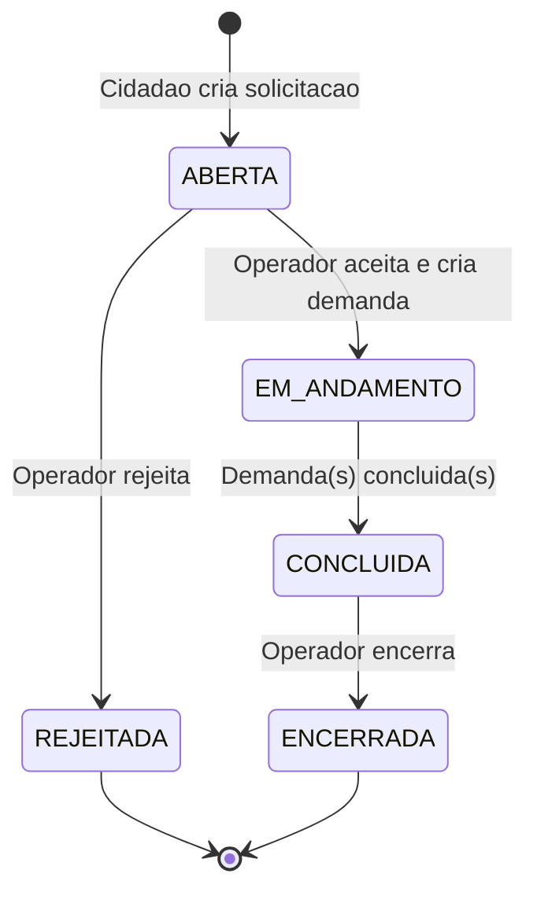
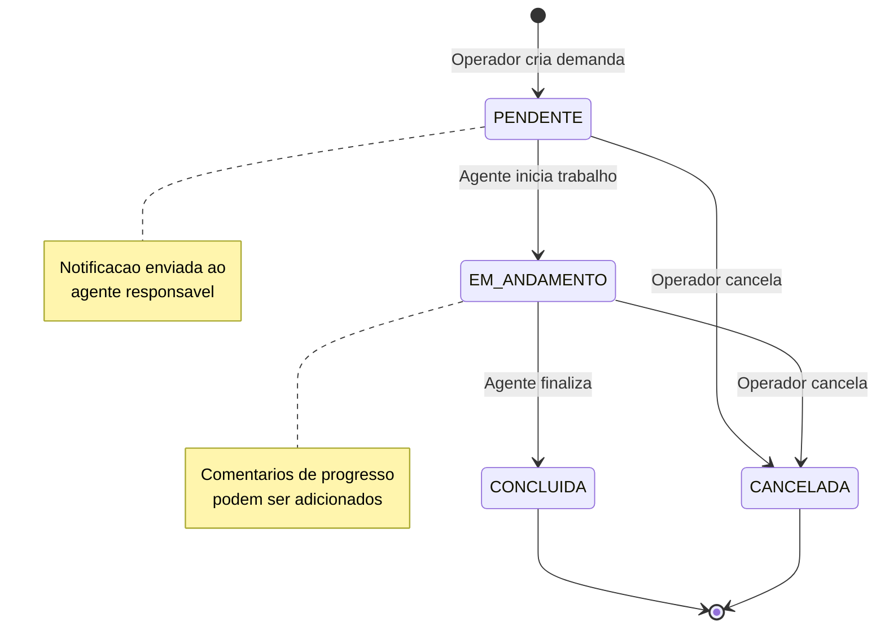

# Fluxo de uma Solicitacao

## Visao geral

Diagrama do ciclo de vida completo de uma solicitacao no SIGESI, desde a criacao pelo cidadao ate a conclusao da demanda de trabalho.

### Roles envolvidas

| Role | Responsabilidades |
|------|-------------------|
| **CIDADAO** | Cria solicitacoes e acompanha o andamento |
| **OPERADOR** | Gerencia solicitacoes, cria demandas, atribui responsaveis |
| **AGENTE** | Executa demandas, adiciona comentarios de progresso |
| **ADMIN** | Acesso total ao sistema |

```mermaid
flowchart TD
    %% ===== FASE 1: CRIACAO DA SOLICITACAO =====
    START([Cidadao identifica problema de infraestrutura])
    START --> LOGIN[/Login via Google OAuth2/]
    LOGIN --> FORM[Preenche solicitacao]

    FORM --> DADOS["Informa:
    - Assunto (BURACO, ESGOTO, ILUMINACAO, LIMPEZA, OUTROS)
    - Descricao do problema
    - Local (endereco)"]

    DADOS --> ANEXO{Possui arquivos?}
    ANEXO -- Sim --> UPLOAD[Upload de anexos no MinIO]
    UPLOAD --> CRIA_SOL
    ANEXO -- Nao --> CRIA_SOL

    CRIA_SOL[/"POST /api/solicitacoes/
    Status: ABERTA
    Data: automatica"/]

    %% ===== FASE 2: TRIAGEM =====
    CRIA_SOL --> TRIAGEM["OPERADOR/ADMIN
    analisa a solicitacao"]

    TRIAGEM --> VALIDA{Solicitacao valida?}

    VALIDA -- Nao --> REJEITADA["PATCH /api/solicitacoes/{id}
    Status: REJEITADA"]
    REJEITADA --> FIM_REJ([Solicitacao encerrada sem atendimento])

    VALIDA -- Sim --> ANDAMENTO["PATCH /api/solicitacoes/{id}
    Status: EM_ANDAMENTO"]

    %% ===== FASE 3: CRIACAO DA DEMANDA =====
    ANDAMENTO --> CRIA_DEM["OPERADOR/ADMIN cria Demanda
    POST /api/demandas/"]

    CRIA_DEM --> DEF_DEM["Define:
    - Prazo
    - Responsavel (AGENTE)
    - Materiais necessarios"]

    DEF_DEM --> TEM_RESP{Responsavel atribuido?}
    TEM_RESP -- Sim --> NOTIF_ASSIGN["Notificacao via RabbitMQ
    Evento: demand_assigned
    Email enviado ao AGENTE"]
    TEM_RESP -- Nao --> DEM_PENDENTE

    NOTIF_ASSIGN --> DEM_PENDENTE["Demanda criada
    Status: PENDENTE"]

    %% ===== FASE 4: EXECUCAO DA DEMANDA =====
    DEM_PENDENTE --> AGENTE_INICIA["AGENTE inicia trabalho
    PATCH /api/demandas/{id}
    Status: EM_ANDAMENTO"]

    AGENTE_INICIA --> NOTIF_STATUS1["Notificacao via RabbitMQ
    Evento: status_changed
    PENDENTE -> EM_ANDAMENTO"]

    NOTIF_STATUS1 --> EXEC["AGENTE executa
    a demanda"]

    EXEC --> COMMENT["AGENTE/OPERADOR adiciona
    comentarios de progresso
    POST /api/comentarios/"]

    COMMENT --> MATERIAL{Precisa de materiais?}
    MATERIAL -- Sim --> ADD_MAT["OPERADOR atualiza materiais
    PATCH /api/demandas/{id}
    (lista de materiais + quantidade)"]
    ADD_MAT --> CONTINUA
    MATERIAL -- Nao --> CONTINUA

    CONTINUA --> CANCELAR{Demanda cancelada?}
    CANCELAR -- Sim --> DEM_CANCELADA["PATCH /api/demandas/{id}
    Status: CANCELADA"]
    DEM_CANCELADA --> NOTIF_CANCEL["Notificacao via RabbitMQ
    Evento: status_changed
    EM_ANDAMENTO -> CANCELADA"]
    NOTIF_CANCEL --> REAVALIA["OPERADOR reavalia
    a solicitacao"]
    REAVALIA --> TRIAGEM

    CANCELAR -- Nao --> FINALIZA

    %% ===== FASE 5: CONCLUSAO =====
    FINALIZA["AGENTE conclui trabalho
    PATCH /api/demandas/{id}
    Status: CONCLUIDA"]

    FINALIZA --> NOTIF_STATUS2["Notificacao via RabbitMQ
    Evento: status_changed
    EM_ANDAMENTO -> CONCLUIDA"]

    NOTIF_STATUS2 --> SOL_CONC["OPERADOR atualiza solicitacao
    PATCH /api/solicitacoes/{id}
    Status: CONCLUIDA"]

    SOL_CONC --> ENCERRA["OPERADOR encerra solicitacao
    PATCH /api/solicitacoes/{id}
    Status: ENCERRADA"]

    ENCERRA --> FIM([Solicitacao encerrada com sucesso])

    %% ===== ESTILOS =====
    classDef cidadao fill:#4CAF50,color:#fff,stroke:#388E3C
    classDef operador fill:#2196F3,color:#fff,stroke:#1565C0
    classDef agente fill:#FF9800,color:#fff,stroke:#E65100
    classDef notif fill:#9C27B0,color:#fff,stroke:#6A1B9A
    classDef status fill:#607D8B,color:#fff,stroke:#37474F
    classDef fim fill:#F44336,color:#fff,stroke:#C62828

    class START,LOGIN,FORM,DADOS,ANEXO,UPLOAD cidadao
    class TRIAGEM,VALIDA,CRIA_DEM,DEF_DEM,REAVALIA,SOL_CONC,ENCERRA operador
    class AGENTE_INICIA,EXEC,COMMENT,CONTINUA,FINALIZA agente
    class NOTIF_ASSIGN,NOTIF_STATUS1,NOTIF_STATUS2,NOTIF_CANCEL notif
    class CRIA_SOL,ANDAMENTO,REJEITADA,DEM_PENDENTE,DEM_CANCELADA status
    class FIM_REJ,FIM fim
```

## Transicoes de status

### Solicitacao

### Demanda

## Diagrama de sequencia

```mermaid
sequenceDiagram
    actor C as Cidadao
    actor OP as Operador
    actor AG as Agente

    participant FE as Frontend
    participant API as Backend (Spring Boot)
    participant DB as PostgreSQL
    participant S3 as MinIO
    participant MQ as RabbitMQ
    participant NS as Notification Service

    %% ===== AUTENTICACAO =====
    rect rgb(232, 245, 233)
        Note over C, API: Autenticacao
        C->>FE: Acessa o sistema
        FE->>API: Redireciona para OAuth2
        API->>API: Google OAuth2 Login
        API->>DB: processOAuthPostLogin() - cria/atualiza usuario
        DB-->>API: Usuario (role: CIDADAO)
        API-->>FE: Redirect com sessao autenticada
        FE-->>C: Dashboard
    end

    %% ===== UPLOAD DE ANEXOS (OPCIONAL) =====
    rect rgb(255, 243, 224)
        Note over C, S3: Upload de anexos (opcional)
        C->>FE: Seleciona arquivos para anexar
        FE->>API: POST /api/arquivos/ (multipart)
        API->>S3: Armazena arquivo (storageKey unico)
        S3-->>API: OK
        API->>DB: Salva metadados do Arquivo
        DB-->>API: Arquivo (id, nomeOriginal, storageKey)
        API-->>FE: ArquivoResponseDTO (id)
        FE-->>C: Anexo carregado
    end

    %% ===== CRIACAO DA SOLICITACAO =====
    rect rgb(232, 245, 233)
        Note over C, DB: Criacao da solicitacao
        C->>FE: Preenche formulario (assunto, descricao, local, anexos)
        FE->>API: POST /api/solicitacoes/
        API->>DB: Busca Usuario (autorId)
        API->>DB: Busca Endereco (localId)
        API->>DB: Busca Arquivos (anexoIds)
        API->>DB: Salva Solicitacao (status: ABERTA, data: now())
        DB-->>API: Solicitacao criada
        API-->>FE: SolicitacaoResponseDTO (201 Created)
        FE-->>C: Solicitacao registrada com sucesso
    end

    %% ===== TRIAGEM =====
    rect rgb(227, 242, 253)
        Note over OP, DB: Triagem pelo Operador
        OP->>FE: Acessa lista de solicitacoes
        FE->>API: GET /api/solicitacoes/
        API->>DB: findAllByOrderByIdAsc() (ve todas - role OPERADOR)
        DB-->>API: Lista de solicitacoes
        API-->>FE: List of SolicitacaoResponseDTO
        FE-->>OP: Exibe solicitacoes ABERTAS
    end

    %% ===== CAMINHO: REJEICAO =====
    rect rgb(255, 235, 238)
        Note over OP, DB: Alternativa - Rejeicao
        OP->>FE: Rejeita solicitacao
        FE->>API: PATCH /api/solicitacoes/{id} (status: REJEITADA)
        API->>DB: Atualiza status para REJEITADA
        DB-->>API: OK
        API-->>FE: SolicitacaoResponseDTO
        FE-->>OP: Solicitacao rejeitada
    end

    %% ===== CAMINHO: ACEITACAO E CRIACAO DE DEMANDA =====
    rect rgb(227, 242, 253)
        Note over OP, MQ: Aceitacao e criacao de demanda
        OP->>FE: Aceita solicitacao
        FE->>API: PATCH /api/solicitacoes/{id} (status: EM_ANDAMENTO)
        API->>DB: Atualiza status para EM_ANDAMENTO
        DB-->>API: OK
        API-->>FE: SolicitacaoResponseDTO

        OP->>FE: Cria demanda (prazo, responsavel, materiais)
        FE->>API: POST /api/demandas/
        API->>DB: Busca Solicitacao (solicitacaoId)
        API->>DB: Busca Usuario responsavel (responsavelId)
        API->>DB: Busca Materiais (materialIds)
        API->>DB: Salva Demanda (status: PENDENTE) + DemandaMateriais
        DB-->>API: Demanda criada

        alt Responsavel atribuido
            API->>MQ: Publica evento "assigned"
            MQ->>NS: Consome evento
            NS->>AG: Envia email de notificacao
        end

        API-->>FE: DemandaResponseDTO (201 Created)
        FE-->>OP: Demanda criada com sucesso
    end

    %% ===== EXECUCAO DA DEMANDA =====
    rect rgb(255, 243, 224)
        Note over AG, MQ: Execucao da demanda pelo Agente
        AG->>FE: Consulta suas demandas
        FE->>API: GET /api/demandas/responsavel?responsavelId={id}
        API->>DB: findByResponsavelIdOrderByPrazoAsc()
        DB-->>API: Lista de demandas
        API-->>FE: List of DemandaResponseDTO
        FE-->>AG: Exibe demandas PENDENTES

        AG->>FE: Inicia trabalho na demanda
        FE->>API: PATCH /api/demandas/{id} (status: EM_ANDAMENTO)
        API->>DB: Atualiza status para EM_ANDAMENTO
        DB-->>API: OK
        API->>MQ: Publica evento "status_changed" (PENDENTE -> EM_ANDAMENTO)
        MQ->>NS: Consome evento
        API-->>FE: DemandaResponseDTO
        FE-->>AG: Status atualizado
    end

    %% ===== COMENTARIOS DE PROGRESSO =====
    rect rgb(243, 229, 245)
        Note over AG, DB: Acompanhamento com comentarios
        loop Durante a execucao
            AG->>FE: Adiciona comentario de progresso
            FE->>API: POST /api/comentarios/
            API->>DB: Busca Demanda (demandaId)
            API->>DB: Busca Usuario autor (autorId)
            API->>DB: Salva Comentario (criadoEm: now())
            DB-->>API: Comentario criado
            API-->>FE: ComentarioResponseDTO (201 Created)
            FE-->>AG: Comentario registrado
        end

        OP->>FE: Acompanha progresso
        FE->>API: GET /api/comentarios/demanda/{demandaId}
        API->>DB: findByDemandaIdOrderByCriadoEmAsc()
        DB-->>API: Lista de comentarios
        API-->>FE: List of ComentarioResponseDTO
        FE-->>OP: Exibe historico de comentarios
    end

    %% ===== CONCLUSAO DA DEMANDA =====
    rect rgb(232, 245, 233)
        Note over AG, MQ: Conclusao
        AG->>FE: Marca demanda como concluida
        FE->>API: PATCH /api/demandas/{id} (status: CONCLUIDA)
        API->>DB: Atualiza status para CONCLUIDA
        DB-->>API: OK
        API->>MQ: Publica evento "status_changed" (EM_ANDAMENTO -> CONCLUIDA)
        MQ->>NS: Consome evento
        NS->>AG: Notificacao de conclusao
        API-->>FE: DemandaResponseDTO
        FE-->>AG: Demanda concluida
    end

    %% ===== ENCERRAMENTO DA SOLICITACAO =====
    rect rgb(227, 242, 253)
        Note over OP, DB: Encerramento da solicitacao
        OP->>FE: Atualiza solicitacao
        FE->>API: PATCH /api/solicitacoes/{id} (status: CONCLUIDA)
        API->>DB: Atualiza status para CONCLUIDA
        DB-->>API: OK
        API-->>FE: SolicitacaoResponseDTO

        OP->>FE: Encerra solicitacao
        FE->>API: PATCH /api/solicitacoes/{id} (status: ENCERRADA)
        API->>DB: Atualiza status para ENCERRADA
        DB-->>API: OK
        API-->>FE: SolicitacaoResponseDTO
        FE-->>OP: Solicitacao encerrada
    end
```

## Eventos de notificacao (RabbitMQ)

| Evento | Gatilho | Destinatario | Dados enviados |
|--------|---------|-------------|----------------|
| `assigned` | Demanda atribuida a um agente | Agente responsavel | demandaId, assunto, prazo, email |
| `status_changed` | Status da demanda alterado | Agente responsavel | demandaId, statusAnterior, statusNovo, prazo |
